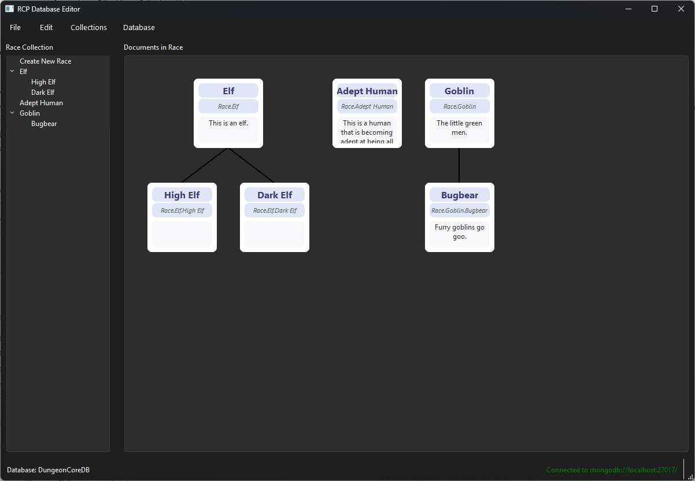

# RCP Database Editor

**RCP Database Editor** is a modern, PyQt6-based GUI application for managing hierarchical game data (such as Races, Classes, and Professions) stored in a MongoDB database. It provides a visual, user-friendly interface for creating, editing, visualizing, and organizing complex data structures, making it ideal for game designers and developers.

---

## Features

- **Visual Org Chart:** Interactive canvas for visualizing hierarchical relationships between entities.
- **MongoDB Integration:** Secure, configurable connection to MongoDB for persistent storage.
- **Dynamic Forms:** Auto-generated forms for editing and creating new entities.
- **Custom Widgets:** Beautiful, modern UI components for enhanced usability.
- **Logging:** Centralized logging for debugging and audit trails.
- **Extensible Architecture:** Modular codebase for easy customization and extension.

---

## Directory Structure

```text
src/
│
├── env.py                # Loads environment variables for MongoDB configuration
├── main.py               # Application entry point
│
├── db/
│   └── mongo_handler.py  # MongoDB connection and CRUD operations
│
├── forms/
│   └── form_data.py      # Data structures and helpers for form generation
│
├── models/
│   └── pydantic_models.py # Pydantic models for data validation
│
├── utils/
│   └── helpers.py        # Logging, validation, and utility functions
│
└── widgets/
    ├── application.py    # Main application window and layout
    ├── main_window.py    # Alternative main window with tree and editor
    ├── canvas.py         # Org chart visualization widget
    ├── nav_panel.py      # Navigation panel for collections and hierarchy
    ├── form_card.py      # Form widget for editing a single document
    ├── editor_widget.py  # Simple editor for form data
    ├── tree_widget.py    # Tree view for collection types
    ├── custom_widgets.py # Styled custom UI components
    ├── new_dialog.py     # Dialog for creating new documents
    ├── update_dialog.py  # Dialog for updating documents
    ├── delete_dialog.py  # Dialog for confirming deletions
    ├── org_chart_box.py  # Visual node for org chart
    └── org_chart_lines.py# Draws lines between org chart nodes
```

---

## Module Overview

### `env.py`

Loads MongoDB connection settings from environment variables using `python-dotenv`.

### `main.py`

Initializes the application, connects to MongoDB, and launches the main window.

### `db/mongo_handler.py`

Encapsulates MongoDB connection logic and CRUD operations, with robust error handling.

### `forms/form_data.py`

Defines collection types and dynamic form data structures for Races, Classes, and Professions.

### `models/pydantic_models.py`

Pydantic models for validating and serializing documents, ensuring data integrity.

### `utils/helpers.py`

Centralized logging setup, input validation, and utility functions for data formatting and application refresh.

### `widgets/`

- **application.py:** Main window with navigation, canvas, and form card.
- **main_window.py:** Alternative window with tree and editor widgets.
- **canvas.py:** Visualizes hierarchical data as an org chart.
- **nav_panel.py:** Navigation for selecting and creating entities.
- **form_card.py:** Dynamic form for editing a single document.
- **editor_widget.py:** Simple data editor.
- **tree_widget.py:** Tree view for browsing collection types.
- **custom_widgets.py:** Styled buttons, labels, and layouts.
- **new_dialog.py:** Dialog for creating new documents.
- **update_dialog.py:** Dialog for updating existing documents.
- **delete_dialog.py:** Dialog for confirming deletions.
- **org_chart_box.py:** Visual node for org chart.
- **org_chart_lines.py:** Draws connecting lines in org chart.

---

## Getting Started

### Prerequisites

- Python 3.10+
- MongoDB instance (local or remote)
- Install dependencies:

```sh
pip install -r requirements.txt
```

### Environment Setup

Create a `.env` file in the root directory with the following variables:

```env
MONGO_URI=mongodb://localhost:27017/
MONGO_DB_NAME=your_database_name
MONGO_USERNAME=your_username
MONGO_PASSWORD=your_password
```

### Running the Application

```sh
python src/main.py
```

---

## Usage

- **Browse Collections:** Use the navigation panel to select Races, Classes, or Professions.
- **Visualize Hierarchy:** The canvas displays the org chart for the selected collection.
- **Create/Edit/Delete:** Use dialogs and forms to manage documents.
- **Logging:** Logs are saved in `src/logs/rcp_db_editor.log`.

---

## Extending the Editor

- Add new collection types in `forms/form_data.py`.
- Define new data models in `models/pydantic_models.py`.
- Create new widgets or dialogs in `widgets/`.

---

## License

MIT License

---

## Screenshots



---

## Authors

- saviornt
- [Contributors]
      - None

---

This documentation provides a complete overview and usage guide for the RCP Database Editor. Let me know if you want to add badges, advanced usage, or contribution guidelines!
